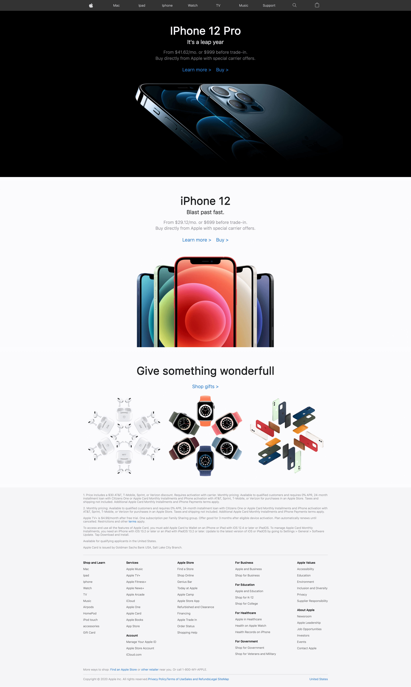
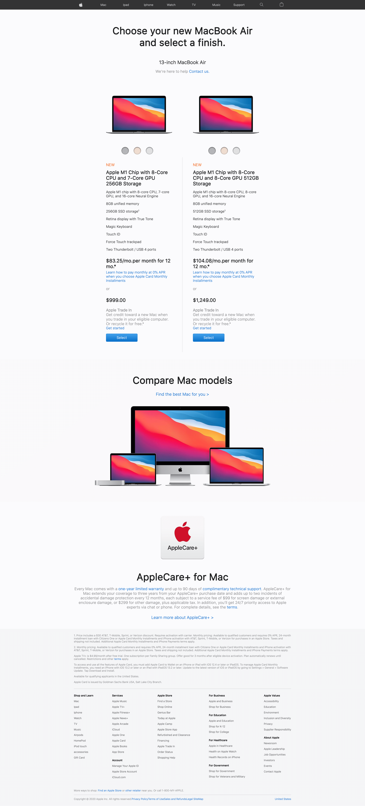

# Procesverslag
**Auteur:** Jimmy Dekker

## Bronnenlijst
1. -bron 1-
2. -bron 2-
3. -...-

## Eindgesprek (week 7/8)

Over het algemeen ging dit vak erg goed. Sommige onderdelen bleken iets meer werk te zijn dan ik had verwacht maar alles is uiteindelijk gelukt. Toen ik klaar was heb ik nog wat extra tijd besteed aan details zoals: backup fonts, css classes, extra animaties, scroll events, SVG's, extra microinteracties, focus en hover states en ik heb de tijd genomen om de CSS netter te maken en te voorzien van comments. Ook heb ik nog wat extra tijd gestoken in een kleine easter egg die je kan activeren door snel "windows te typen"

**Screenshot(s):**

**Screenshot 1:**

de home pagina voor grote schermen:

**Screenshot 2:**

de home pagina voor kleine schermen:

**Screenshot 3:**

de Mac pagina voor grote schermen:

**Screenshot 4:**

de Mac pagina voor kleine schermen:

**Screenshot 5:**

de navigatie voor kleine schermen:

## Voortgang 3 (week 6)

### Stand van zaken

Deze week heb ik de 2e pagina in elkaar gezet. Deze heb ik gelijk responsive gemaakt. Voor het eindgesprek wil ik de Macbooks nog kunnen veranderen van kleur en ga ik extra (viewport) animaties toevoegen aan beide pagina's.

**Screenshot(s):**

Omdat er niks is verandert heb ik deze week alleen mobiele en desktop screenshots van de Mac pagina.

**Screenshot 1:**

Dit is een screenshot van de mobiele versie van de Mac pagina. Op dit formaat staan de Macbook air opties onder elkaar. Ook heb ik de kleuren opties onder de ageeldingen gemaakt, op de site van Apple is dit gedaan met een afbeelding. Ik heb er voor gekozen om dit met css te doen. Ik heb voor het eerst gebruik gemaakt van ::after.

**Screenshot 2:**

Bij de desktop versie heb ik de Macbook optie naast elkaar gezet.

### Agenda voor meeting

Samen met het groepje opgesteld

| Luke      | Melvin          | Sam    | Jimmy        |
| ---            | ---                | ---          | ---              |
| nvt.  | nvt.  |  Vragen over de navigatie  | nvt.  |
|   |   |   |   |
|   |   |   |   |
|   |   |   |   |

### Verslag van meeting

Ik was bijna vergeten dat we een meeting hadden. Gelukkig kwam precies binnen toen ik aan de beurt was. Ik heb verder geen vragen gesteld maar heb wel wat tips gekregen waar ik me op zou kunnen focussen voor een hoger cijger. Deze extra toevoegingen wil ik deze vakantie gaan toevoegen.

## Voortgang 2 (week 5)

### Stand van zaken

De 2e sprint ging weer volgens de planning. Het responsive maken van de footer bleek achteraf een stuk meer werk dan ik had gehoopt maar ik ben wel erg blij met het resultaat. Ook heb ik een aantal animaties toegevoegd aan de pagina's.

Ik kwam er deze week wel achter dat Apple hun website erg vaak update. Ik kon een aantal elementen niet meer terug vinden en heb er daarom voor gekozen om ze te combineren met elementen van de nieuwe pagina.

**Screenshot(s):**

Vorige keer heb ik de site laten zien voor mobiel. Deze spint is de mobiele versie nauwelijks veranderd, daarom vooral screenshots in desktop view.

**Screenshot 1:**

Dit is de eerste pagina voor desktop. Zoals je ziet heb ik nog 2 elementen toegevoegd aan de onderste container. In mobile view komen deze verticaal boven elkaar te liggen.

**Screenshot 2:**

De footer gemaakt voor desktop. Zoals je ziet zitten er ontzettend veel list items in de footer, Dit was best veel werk om allemaal netjes te krijgen.

**Screenshot 3:**

Voor de mobiele versie van de footer heb ik alle lijsten laten inklappen en heb ik een + toegevoegd. Het inklappen is erg handig voor mobiel omdat het de pagina een stuk korten maakt.

**Screenshot 4:**

Zoals je ziet is elk ingeklapt element uitklapbaar. Als je er op klikt verschijnen alle list items en draait de "+" zodat er een kruisje staat. Als je op het kruisje drukt klappen de list items weer in.

### Agenda voor meeting

Samen met het groepje opgesteld

| Luke      | Melvin          | Sam    | Jimmy        |
| ---            | ---                | ---          | ---              |
| Bij svg: Waarom is ‘stroke’ geen css eigenschap?  | nvt.  | Font die gedownload is gebruiken.    | De Apple website heeft vaak updates, hoe kan ik dat het beste aanpakken ?  |
| Bij het drukken op een button herlaad alles ipv de js-actie te ondernemen.  |   | Hoe kan ik dit menu uit laten klappen als ik erop klik? |   |
| Hoe klap ik een ‘uitklapmenu’ uit in animatie? |    |   Moet je al een grid gebruiken op een small screen of alleen als er een breakpoint komt?   |    |
| Form heeft geen action. Maar weet niet wat ik moet invullen. |    |   Wat betekent de :after en de :before precies? (weet het zelf wel ongeveer)   |    |

### Verslag van meeting

De meeting was kort maar krachtig. De oplossing die ik had gekozen voor de vaak veranderende site was prima. Om mezelf wat meer uit de dagen kreeg ik het advies om ook te kijken naar de :focus status voor mensen die Tab gebruiken. Ik denk dat de viewport animaties het lastigste gaan worden maar dat wil ik in de kerstvakantie gaan maken.

## Voortgang 1 (week 3)

### Stand van zaken

Over het algemeen ging de eerste sprint van het coderen behoorlijk goed. Ik heb een klein beetje moeite gehad met de faded transparent background van de nav, maar verder ben ik nog geen problemen tegen gekomen.

**Screenshot(s):**

De opzet van de eerste pagina is gemaakt, de navigatie werkt responsive en heeft een breakpoint voor 2 verschillende views. Ook de rest van de pagina is responsive gemaakt en past de afbeeldingen aan als de schermbreedte groot genoeg is.

Qua stijl heb ik geprobeerd om zo dicht mogelijk bij het design van Apple te blijven zonder de element stijlen te bekijken (op kleuren na). Zo koste het wat meer moeite om de fade van het menu goed te krijgen maar het is toch gelukt.

**Screenshot 1:**

De eerste pagina op klein scherm.

**Screenshot 2:**

De navigatie op klein scherm, Deze heb ik al animaties gegeven. Zo animeert de hamburger naar een kruis.

**Screenshot 3:**

Dit is de eerste pagina op klein scherm. Je ziet hier dat de afbeeldingen groter zijn geworden maar de nav nogsteeds uitklapbaar is.

**Screenshot 4:**

Dit is de eerste pagina op grotere schermen. De navigatie is nu anders.

### Agenda voor meeting

Samen met het groepje opgesteld

| Luke      | Melvin          | Sam    | Jimmy        |
| ---            | ---                | ---          | ---              |
| margin 0 werkt niet  | nvt.  | Tips over de nav    | viewport animaties  |
| elementen na relative en absolute |   | fonts van andere website toevoeten |   |
| font via telefoon anders dan desktop |    |      |    |

### Verslag van meeting

Het gesprek ging goed. Ik had niet veel vragen. Voor de viewport animaties is aangeraden om dit te doen met javascript, ik heb nog geen idee hoe ik dit ga doen maar hier ga ik nog naar op onderzoek. Verder loop ik nog op schema en is de eerste pagina bijna af voor mobiel.

## Breakdownschets (week 1)

## Intake (week 1)

**Je startniveau:** Blauwe piste

**Je focus:** alles!

**Je opdracht:** https://www.apple.com/

**Screenshot(s) van de eerste pagina (small screen):**

**Screenshot(s) van de tweede pagina (small screen):**

